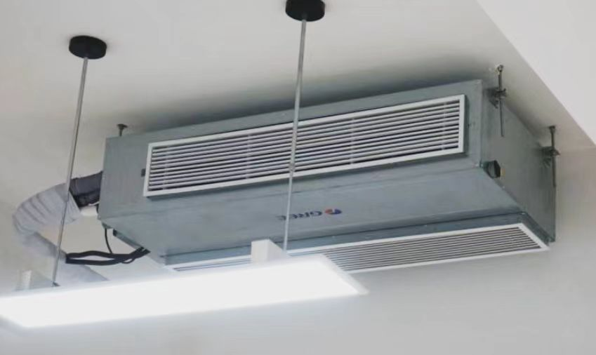

# 设施配备

学校给每个同学配备了一套书桌和一个储物箱，同时你还可以自己在桌边挂一些兜子之类的东西，椅子下面也有个平台给你放书用，总的来说是挺能装的。

现在每个教室应该都安装了格力的中央空调，温度设置在二十几度，室内还是挺凉快干爽的，但是在窗边的同学可能会要正对空调凉风吹的比较冷，建议夏天也备一件外套或浴巾之类的挡风。

<figure><figcaption>
空调
</figcaption></figure>

每间教室内还配备了希沃白板和展台，方便教学使用，班主任允许后中午和晚上吃晚饭可以在上面放歌放视频。

除此以外，教室内还有一台壁挂的电视，之前是用来在活动时直播，但是现在基本上没使用过。
